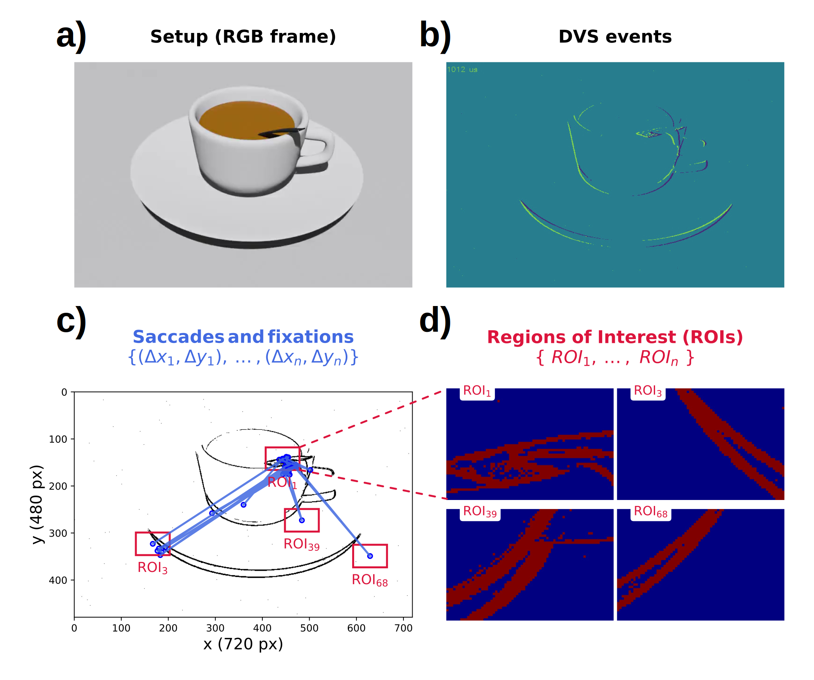

# Neuromorphic attention simulator
Bio-inspired pipeline for simulating active vision with event-based sensing and attentional ROIs from 3D objects.

  

## Citation
This work has been presented at the Neuromorphic Computing for Development and Learning Workshop (NCDL) at the International Conference on Development and Learning (ICDL):

Rodríguez García, A., Ghosh, A., Ramaswamy, S., & D'Angelo, G. (2025). Object perception through visual attention. Zenodo. https://doi.org/10.5281/zenodo.15802809
